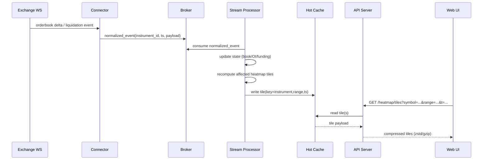
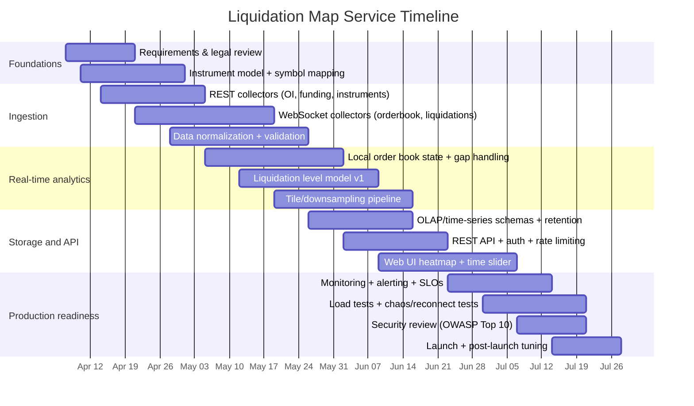

# Building a Liquidation Map API Like CoinGlass: Data, Architecture, and Implementation

## Executive summary

CoinGlass’s “liquidation map” and “liquidation heatmap” endpoints strongly suggest that the product is not merely a replay of raw liquidation prints; it is an *analytics layer* that converts underlying market data into **estimated liquidation levels** across price. In the v4 API reference, the “Pair Liquidation Heatmap Model1” endpoint is described as providing “liquidation levels on a heatmap chart … calculated based on market data and liquidation leverage levels,” and the “Pair Liquidation Map” endpoint is described similarly as a mapped liquidation visualization “calculated based on market data and liquidation leverage levels.” citeturn31view0turn5view0

At the same time, CoinGlass separately exposes **forced liquidation order** data via both REST (“Liquidation Order” endpoint: “liquidation order data from the past 7 days”) and WebSocket (“liquidation order snapshot streams … forced liquidation orders for market symbols”). This separation is important: it implies two distinct pipelines—(a) real liquidation events and (b) modeled liquidation *levels* that require inference. citeturn28view1turn8view4

A comparable service therefore usually has three layers:

1. **Ingestion + normalization** of exchange data feeds (order book, price/mark price, open interest, funding rates; optionally liquidation events when an exchange provides them).
2. **Real-time analytics** that transforms those inputs into “liquidation level surfaces” (a 2D function of price × time, with intensity proportional to estimated liquidation notional).
3. **API + visualization** optimized for end-user interaction (range queries, downsampling, tiling, clustering, time sliders).

CoinGlass markets its API as having broad exchange coverage (30+), standardized schemas, real-time WebSocket streaming, and deep order book capabilities, which indicates a substantial data engineering investment (collection, validation, reconciliation, historical completeness, and consistent symbol/instrument modeling). citeturn8view1turn11view1

---

## What CoinGlass’s liquidation map endpoints reveal

### The surface area of the CoinGlass “liquidation” product family

From the v4 API navigation and endpoint descriptions, CoinGlass explicitly distinguishes (at least) the following liquidation-related datasets:

- **Liquidation orders / events**: REST endpoint providing liquidation order data from the past 7 days; WebSocket streams providing forced liquidation orders. citeturn28view1turn8view4  
- **Liquidation heatmaps (Model1/2/3)**: endpoints providing “liquidation levels” rendered as a heatmap, “calculated based on market data and liquidation leverage levels.” citeturn31view0  
- **Liquidation maps**: endpoints described as mapped liquidation visualizations, also “calculated based on market data and liquidation leverage levels.” citeturn5view0  

CoinGlass also positions API v4 as a more “structured, scalable, and analytics-oriented” architecture, highlighting standardized data models and “unified symbol and asset representations”—which are prerequisites for cross-exchange liquidation analytics. citeturn11view1turn8view1

### What is likely “known” vs “inferred” in a liquidation map

Because exchanges generally do **not** publish the full distribution of trader leverage and liquidation prices for all participants, “liquidation levels” are typically **modeled** using public market observables:

- **Mark price / index price** and **funding rate** (perpetual swap mechanics) citeturn27view2turn27view3  
- **Open interest** (how much notional exposure exists) citeturn27view4turn25search1  
- **Contract specs / instrument metadata** (tick size, contract type, settlement) citeturn25search3turn23view0  
- **Order book depth** and its evolution (liquidity distribution can interact with cascades and supports/resistance inference) citeturn27view1turn25search2  
- **Observed liquidation events** (where available) to calibrate/validate the model citeturn26search0turn8view4  

This matches CoinGlass’s own phrasing that heatmaps/maps are computed from “market data and liquidation leverage levels.” citeturn31view0turn5view0

### Authentication and access patterns

CoinGlass’s “Open API v4” is described as standard HTTP REST with an API key passed in a request header (`CG-API-KEY`) and a base URL `https://open-api-v4.coinglass.com`. citeturn11view0  
This matches a typical “data API” posture: authenticated access, stable endpoint contracts, and productized SLAs. CoinGlass’s own materials emphasize unified schema and production-grade use cases (monitoring, quantitative research). citeturn11view1turn8view1

---

## Data sources and ingestion

### Core data categories you need

A liquidation map service needs more than liquidation prints. The minimal set for a credible “liquidation levels” model is:

- **Instruments reference data**: symbol, contract type (linear/inverse), margin asset, tick size, settlement rules, trading status. citeturn25search3turn23view0  
- **Price surfaces**: last trade, mark price, index price (especially for perps). citeturn27view2  
- **Funding rates**: current/historical funding rate and timestamps. citeturn27view3turn25search0  
- **Open interest**: current and historical OI; sometimes with intervals and pagination. citeturn27view4turn25search1  
- **Order book**: snapshot + deltas for building local books and liquidity distribution. citeturn27view1turn25search2  
- **Liquidation events** (if available): forced liquidation stream/event feed for calibration and “recent liquidations” overlays. citeturn26search0turn8view4  

Also relevant (often optional for MVP):

- **Margin and risk parameters**: maintenance margin schedules, risk limits, liquidation price formulas. These are partially public via “risk limits” / “position tiers” endpoints on some venues, but the true user-level margin state is private. citeturn25search5turn28view0  

### What you can actually collect publicly (examples)

Below are examples from major exchange API docs showing the shape and frequency of inputs you will rely on.

- Order book updates can be high frequency. For example, Binance USDⓈ-M futures diff book depth streams can push at 250ms / 500ms / 100ms and provide delta updates (`b`, `a`) with update IDs (`U`, `u`, `pu`). citeturn27view1  
- Bybit’s public order book WebSocket supports multiple depths and lists push frequencies down to 10ms for level-1, and up to 200ms for level-1000 (linear/inverse), with explicit snapshot/delta processing rules. citeturn25search2turn26search11  
- Binance provides REST endpoints for mark price + funding components (`/fapi/v1/premiumIndex`) including mark price, index price, last funding rate, and next funding time; and a funding rate history endpoint (`/fapi/v1/fundingRate`). citeturn27view2turn27view3  
- Bybit provides an open interest endpoint with interval selection and cursor pagination (`/v5/market/open-interest`). citeturn25search1  
- Bybit also explicitly provides a public “all liquidations” WebSocket topic (`allLiquidation.{symbol}`) with push frequency 500ms, positioned as pushing “all liquidations that occur on Bybit.” citeturn26search0turn26search2  
- OKX’s changelog indicates that historical liquidation orders via REST were planned to be unsupported and users should subscribe to a WebSocket liquidation channel instead, illustrating how exchanges can deprecate critical endpoints and force a streaming approach. citeturn13view0  

### Data collection methods and trade-offs

#### REST polling

REST is essential for:
- **Reference data refresh** (instruments list, contract specs) citeturn25search3turn23view0  
- **Slow-changing metrics** (funding history, OI history) citeturn27view3turn25search1  

But REST is usually a poor choice for high-frequency order book/flow due to tight rate limits and latency. Exchanges often nudge developers to WebSockets for market data; for example, Bybit’s developer page says market data via WebSockets is recommended and “WebSocket requests are not counted against the rate limits.” citeturn26search10

#### WebSocket streaming

WebSockets are the backbone for:
- **Order books** (snapshot + deltas; strict sequencing logic) citeturn25search2turn27view1  
- **Liquidation event feeds** when available (e.g., Bybit all-liquidation; CoinGlass liquidation order streams). citeturn26search0turn8view4  

WebSocket complexity tends to move “state correctness” into your system (reconnects, snapshot resets, sequence gaps, replay). Exchanges explicitly document local book maintenance rules (e.g., Bybit order book snapshot/delta handling; Binance update IDs). citeturn25search2turn27view1

#### FIX connectivity

FIX is relevant mainly for order entry and low-latency professional connectivity, but can be part of your design if you plan to offer trading-adjacent features or institutional integration. Archived FTX US API documentation explicitly lists a FIX API alongside REST and WebSocket. citeturn23view0

#### Scraping

Scraping is fragile (HTML changes), operationally expensive, and often violates site/exchange terms for commercial redistribution. Given that CoinGlass sells an API and emphasizes authorized access patterns, a “similar service” should treat scraping only as a last resort for non-core metadata. citeturn11view0turn30search1

---

## Canonical data model and normalization

### Why the data model is the product

CoinGlass emphasizes “standardized data model” and “unified symbol and asset representations,” because cross-venue analytics is impossible without consistent schemas. citeturn8view1turn11view1

A liquidation map service typically needs at least four canonical entities:

- **Exchange**: venue, environment (prod/testnet), region hints.
- **Instrument**: a tradable contract/spot pair with stable instrument_id.
- **Market events**: trades, order book deltas, funding events, OI points.
- **Liquidation events** (optional but valuable): forced liquidation orders / prints.

### Suggested canonical schemas (examples)

Below are example schemas you can adopt (these are *proposed* models designed to normalize across venues).

```sql
-- Instruments: stable cross-venue mapping
CREATE TABLE instrument (
  instrument_id       UUID PRIMARY KEY,
  exchange            TEXT NOT NULL,
  exchange_symbol     TEXT NOT NULL,
  base_asset          TEXT NOT NULL,
  quote_asset         TEXT NOT NULL,
  contract_type       TEXT NOT NULL,     -- perp, futures, option, spot
  margin_asset        TEXT NULL,         -- USDT, USD, coin
  settlement_asset    TEXT NULL,
  min_tick            NUMERIC NULL,
  contract_size       NUMERIC NULL,
  is_inverse          BOOLEAN NOT NULL DEFAULT false,
  status              TEXT NOT NULL,     -- trading, delisted
  first_seen_ts       TIMESTAMPTZ NOT NULL,
  last_seen_ts        TIMESTAMPTZ NOT NULL,
  UNIQUE(exchange, exchange_symbol)
);

-- Liquidation event (when venue supplies it)
CREATE TABLE liquidation_event (
  event_id            UUID PRIMARY KEY,
  exchange            TEXT NOT NULL,
  exchange_event_id   TEXT NULL,         -- if venue provides
  instrument_id       UUID NOT NULL REFERENCES instrument(instrument_id),
  side                TEXT NOT NULL,      -- buy/sell or long/short liquidation
  price               NUMERIC NOT NULL,
  qty                 NUMERIC NOT NULL,
  notional            NUMERIC NULL,       -- computed in quote units
  event_ts            TIMESTAMPTZ NOT NULL,
  ingest_ts           TIMESTAMPTZ NOT NULL,
  raw_json            JSONB NOT NULL
);

-- Open interest time series
CREATE TABLE open_interest_point (
  instrument_id       UUID NOT NULL REFERENCES instrument(instrument_id),
  exchange            TEXT NOT NULL,
  ts                  TIMESTAMPTZ NOT NULL,
  open_interest       NUMERIC NOT NULL,
  oi_unit             TEXT NOT NULL,      -- base, quote; venue-specific mapping
  PRIMARY KEY (instrument_id, ts)
);

-- Funding rate events
CREATE TABLE funding_rate_event (
  instrument_id       UUID NOT NULL REFERENCES instrument(instrument_id),
  exchange            TEXT NOT NULL,
  funding_time        TIMESTAMPTZ NOT NULL,
  funding_rate        NUMERIC NOT NULL,
  mark_price          NUMERIC NULL,
  PRIMARY KEY (instrument_id, funding_time)
);
```

These schemas are grounded in fields that exchanges publish:
- Binance’s mark price endpoint returns markPrice, indexPrice, lastFundingRate, nextFundingTime, and time. citeturn27view2  
- Binance funding history returns fundingRate, fundingTime, and may include markPrice at funding time. citeturn27view3  
- Binance open interest endpoint returns openInterest, symbol, and time. citeturn27view4  
- Bybit open interest endpoint returns openInterest values with timestamps and paginates via cursor. citeturn25search1  

For liquidation events, field sets vary widely. As one concrete example of a forced-order schema, Binance’s “User’s Force Orders” response includes fields such as `orderId`, `symbol`, `price`, `avgPrice`, `origQty`, `executedQty`, `side`, `positionSide`, and timestamps. citeturn28view0  
Bybit’s all-liquidation stream exists as a public topic, but its exact payload fields must be normalized per their schema. citeturn26search0

### Normalization and symbol mapping

You will need deterministic rules for:

- **Instrument identity**: `(exchange, exchange_symbol)` is not enough if symbols get reused; keep an internal `instrument_id` and track `first_seen_ts/last_seen_ts`.  
- **Contract type normalization**: linear vs inverse perps; margin asset vs settlement asset. Bybit’s open interest docs explicitly note that OI unit differs (e.g., inverse vs linear), which should be captured as `oi_unit`. citeturn25search1  
- **Time normalization**: millisecond timestamps are typical for WebSocket and many REST endpoints (e.g., Binance depth updates and mark price time fields). citeturn27view1turn27view2  

CoinGlass explicitly pitches “unified symbol and asset representations” and “consistent data models,” which is essentially this mapping layer operationalized across dozens of venues. citeturn11view1turn8view1

---

## Streaming architecture and real-time computation

### Reference architecture

A liquidation map service typically resembles a market data platform plus an analytics engine. A common pattern:

- **Connectors** (per exchange): WebSocket clients (order book, liquidations), REST pollers (OI/funding/instruments).
- **Message bus**: durable append-only log for event replay + fanout to processors.
- **Stream processors**: maintain local state (books), compute derived metrics, build “heatmap tiles.”
- **Serving layer**: low-latency API with caching + precomputed aggregates for common UI queries.

```mermaid
flowchart LR
  subgraph EX[Exchanges]
    WS1[WebSocket<br/>orderbook/liquidations]
    REST1[REST<br/>OI/funding/instruments]
  end

  subgraph ING[Ingestion]
    C1[Connectors<br/>(per exchange)]
    N1[Normalizer<br/>symbol + schema]
  end

  subgraph BUS[Streaming Bus]
    Q1[(Event Log / Broker)]
  end

  subgraph RT[Real-time Compute]
    S1[Orderbook State]
    S2[OI/Funding State]
    A1[Liquidation Level Model]
    A2[Heatmap/Map Aggregator<br/>downsample + tile]
  end

  subgraph STORE[Storage]
    H1[(Hot cache)]
    TS1[(Time-series / OLAP)]
    OBJ[(Object storage<br/>for long retention)]
  end

  subgraph API[API + UI]
    G1[REST/WS API]
    UI1[Liquidation Map UI]
  end

  WS1 --> C1
  REST1 --> C1
  C1 --> N1 --> Q1
  Q1 --> S1
  Q1 --> S2
  S1 --> A1
  S2 --> A1
  A1 --> A2 --> H1
  A2 --> TS1
  TS1 --> G1
  H1 --> G1 --> UI1
  A2 --> OBJ
```

This architecture is driven by the fact that order books and some liquidation feeds can be sub-second. Binance’s futures diff book stream supports updates as fast as 100ms and includes sequencing metadata; Bybit’s order book can be even faster for shallow depths. citeturn27view1turn25search2  
Similarly, Bybit’s all-liquidation stream is documented at 500ms push frequency. citeturn26search0

### Latency targets as a function of the upstream feeds

Instead of choosing a latency target in isolation, derive it from:

- **Upstream update frequencies** (100ms–500ms is common for L2 feeds on major venues) citeturn27view1turn25search2  
- **UI interaction needs** (humans won’t perceive 10ms; but they *do* perceive lag > ~500ms for live heatmaps)

A practical target for a “live” liquidation map MVP is often:

- **P50 end-to-end** (exchange → UI tile): ~300–800ms  
- **P95**: ~1–3s under normal conditions, with explicit “data delayed” UX during volatility spikes

This is a design recommendation; you validate it by measuring feed arrival jitter and processing time under stress. Bybit explicitly warns that in “extreme market volatility” some interfaces may see latency or delays (e.g., open interest endpoint). citeturn25search1

### Sequence diagram for the “tile update” loop



The need to maintain local books and handle snapshot/delta semantics is explicitly stated in Bybit’s order book docs (snapshot first, then deltas; reset on new snapshot) and implicit in Binance’s depth stream design (update IDs and deltas). citeturn25search2turn27view1

---

## Aggregation logic for liquidation maps and heatmaps

### Two products: real liquidations vs predicted liquidation levels

A “CoinGlass-like” offering usually includes both:

1. **Real liquidation events**  
   - CoinGlass provides forced liquidation order streams and a 7-day liquidation order REST endpoint. citeturn8view4turn28view1  
   - Bybit provides a public all-liquidations stream with 500ms frequency. citeturn26search0turn26search2  

2. **Liquidation levels / map / heatmap (predicted)**  
   - CoinGlass describes heatmap and map endpoints as “liquidation levels … calculated based on market data and liquidation leverage levels.” citeturn31view0turn5view0  

Your system should treat these as separate datasets in storage and API (different semantics, different accuracy guarantees).

### Building the liquidation-level model

Because you don’t have trader-by-trader positions, liquidation-level heatmaps are typically built as an **inference model**. A rigorous approach is to make the assumptions explicit and calibrate them.

A common modeling stack:

- **Inputs**
  - Open interest time series by instrument. citeturn27view4turn25search1  
  - Mark price and index price (anchor for liquidation thresholds). citeturn27view2  
  - Funding rate time series (captures long/short pressure; premium dynamics). citeturn27view3turn25search0  
  - Contract metadata (inverse/linear, tick size, etc.). citeturn25search3turn23view0  
  - Optional: order book liquidity distribution (for context/overlay). citeturn25search2turn27view1  

- **Assumptions**
  - A distribution over leverage buckets (e.g., 5×, 10×, 25×, 50×, 100×), possibly conditioned on funding or recent volatility.
  - An allocation of open interest to “entry price cohorts” (a latent variable; you approximate using recent price path + volume profile).

- **Mechanics**
  - For each leverage bucket and assumed entry cohort, compute approximate liquidation prices (long vs short) using mark price conventions. Binance exposes mark price and funding components via `/fapi/v1/premiumIndex`, which provides key anchoring fields (mark price, last funding rate, next funding time). citeturn27view2  
  - Funding rate formulas differ by venue; both Binance and Bybit publish funding explanations that describe premium index and clamping behavior, which matters if you use funding as a regime signal. citeturn24search9turn25search25  

- **Calibration**
  - Where real liquidation events exist (e.g., Bybit all-liquidation, CoinGlass liquidation streams), use them to fit the model’s intensity scaling (so predicted “hot zones” align with actual liquidation clusters over time). citeturn26search0turn8view4  

### Matching, deduplication, and normalization of liquidation events

If you include real liquidation events, you need robust event hygiene:

- **Deduplication keys**: `(exchange, exchange_event_id)` where available; otherwise a hashed signature of `(instrument, side, price, qty, ts_bucket)`.
- **Clock normalization**: store both `event_ts` (venue timestamp) and `ingest_ts` (your receipt time).
- **Cross-venue symbol mapping**: normalize to `instrument_id` immediately at ingestion, so downstream processors never deal with exchange symbols.

CoinGlass explicitly pitches a “standardized data model” and “unified symbol” abstraction, which is exactly what this layer accomplishes. citeturn8view1turn11view1

### Producing “map” outputs suitable for UI

A liquidation map UI typically requires:

- Multi-resolution intensity surfaces (tiles)
- Fast range queries by price range and time window
- Downsampling strategies that preserve peaks (not just averages)
- Optional overlays: price candles, funding regime shifts, OI changes

CoinGlass’s endpoints are positioned as returning chart-ready structures (e.g., “formatted for chart display” appears across API v4 docs, and liquidation endpoints are described as chart/visualization outputs). citeturn10search23turn5view0

---

## Storage, indexing, API design, and visualization

## Historical storage and indexing patterns

### Storage tiers

A three-tier design is common:

- **Hot** (seconds–minutes): in-memory cache for the newest tiles and “now” endpoints.
- **Warm** (days–months): OLAP/time-series optimized for range scans and aggregations.
- **Cold** (months–years): object storage with partitioned files (Parquet) for cheap retention and batch recomputation.

CoinGlass markets massive historical coverage (“high-frequency historical data,” “tick-level order book snapshots,” “8+ years,” “>99% completeness”), which implies multi-tier storage and replay pipelines. citeturn8view1

### Retention policies

Define explicit retention by data type:

- Raw order book deltas: shortest retention (high volume)
- Aggregated book snapshots (e.g., 1s/5s/1m): longer retention
- OI/funding: long retention (low volume, high value)
- Heatmap tiles: long retention with downsampling levels

(These are design choices; validate with user needs and storage costs.)

## API design for a liquidation map service

### Endpoint surface (example)

Below is a sample REST surface for a CoinGlass-like service. It intentionally supports both *events* and *levels*.

```yaml
# Example endpoint definitions (pseudo-OpenAPI)
GET /v1/instruments
  ?exchange=...&type=perp&quote=USDT&status=trading

GET /v1/metrics/open-interest
  ?instrument_id=...&start=...&end=...&interval=1m

GET /v1/metrics/funding-rate
  ?instrument_id=...&start=...&end=...&limit=...

GET /v1/events/liquidations
  ?instrument_id=...&start=...&end=...&min_notional=...
  # cursor pagination

GET /v1/levels/liquidation-heatmap
  ?instrument_id=...&range_pct=10&resolution=256&start=...&end=...

GET /v1/tiles/liquidation-heatmap/{z}/{x}/{y}.pbf
  ?instrument_id=...&t=...&window=15m
```

**Key design points and why they matter:**

- **Cursor-based pagination** for event streams (Bybit open interest already uses `cursor` pagination; FTX US pagination uses time range parameters). citeturn25search1turn23view0  
- **Time-range query parameters** (`start`, `end`) to bound response size; FTX US archived docs describe pagination via `start_time` and `end_time`. citeturn23view0  
- **Rate limit headers and backoff guidance**: FTX US docs explicitly describe HTTP 429 on rate limits; CoinGlass also emphasizes keeping API keys secure; and exchanges commonly enforce throttles. citeturn23view0turn11view0  

### Auth and rate limits

CoinGlass’s quick-start shows a simple API key header (`CG-API-KEY`). citeturn11view0  
Exchanges also document API key headers for authenticated endpoints (e.g., Binance uses `X-MBX-APIKEY` for secure routes). citeturn30search15turn24search13  

For your service:
- Use **API keys** for server-to-server usage and **JWT/OAuth** for end-user UI sessions (especially if you offer dashboards).
- Publish clear limits: “requests per minute,” “tiles per second,” and separate budgets for heavy endpoints.

## Visualization requirements and data contracts

A liquidation heatmap/map UI typically needs:

- **Heatmap layer**: intensity values per price bucket (y-axis) over time (x-axis), with a color scale (log scaling often works better).
- **Clustering / aggregation** for mobile (reduce noise and bandwidth).
- **Time slider**: switch between live (last N minutes) and historical windows.
- **Crosshair readouts**: price, estimated liquidation notional at that price, timestamp.
- **Overlay layers**: price candles, OI line, funding markers.

CoinGlass explicitly positions its liquidation heatmaps/maps as analytic chart outputs; its API v4 marketing also calls out “liquidity heatmap” built from order book depth, implying the front-end expects dense 2D data products. citeturn31view0turn8view2

image_group{"layout":"carousel","aspect_ratio":"16:9","query":["CoinGlass liquidation heatmap chart screenshot","crypto liquidation heatmap visualization","liquidation map heatmap crypto chart"],"num_per_query":1}

---

## Scaling, reliability, monitoring, security, compliance, and delivery plan

## Scaling strategies and technology trade-offs

### Choosing between self-hosting and managed services

CoinGlass’s positioning (“production-grade reliability,” “low-latency WebSocket streaming,” “institutional-grade”) is aligned with managed/automated scaling and strong validation pipelines. citeturn8view1turn11view1

A practical build-vs-buy trade-off:

- **Self-hosting**: lower vendor cost at scale; higher operational burden (SRE, upgrades, incident response).
- **Managed**: faster time-to-market; cost can grow quickly with throughput + retention.

### Comparison tables

#### Streaming / messaging layer (conceptual comparison)

| Option | Strengths | Weaknesses | Best fit |
|---|---|---|---|
| Kafka | Very strong ecosystem for replay, retention, consumer groups; common for market-data style logs | Operationally heavy self-hosted; managed cost can be high at large throughput | Multi-consumer event log, backfills, replay |
| NATS/JetStream | Lower latency, simpler ops footprint | Smaller ecosystem for heavy analytics; retention patterns differ | Very low latency fanout |
| Pulsar | Tiered storage, multi-tenancy | Complexity | Very large multi-tenant platforms |

(These are design comparisons; validate against your team’s ops maturity and throughput requirements.)

#### Databases for historical querying (requested set)

| Database | Primary use in this product | Strengths | Limitations |
|---|---|---|---|
| ClickHouse | OLAP scans for tiles, aggregations, historical analytics | Excellent for time-range aggregation and compressed columnar storage; cloud pricing separates compute/storage citeturn29search1turn29search5 | Modeling/upserts can be nuanced |
| TimescaleDB | Time-series metrics (OI, funding), relational joins | SQL + time-series features; strong for metric-like data citeturn29search2turn29search14 | High-volume tick data can get expensive |
| Elasticsearch | Search + indexing for metadata/events | Flexible queries, text search | Not ideal for large OLAP aggregations |
| Redis | Hot cache, recent tiles, rate limiting | Very low latency | Not a long-term store |

## Order-of-magnitude cost estimates

These are *ballpark* monthly estimates that vary widely by retention, number of instruments, and whether you store raw order book deltas.

### Anchors from public pricing references

- A commonly cited on-demand EC2 baseline: `t3.large` starting around **$0.0832/hour** (≈$60/month if always-on), which is a useful “small ingestion node” mental model. citeturn29search8turn29search12  
- ClickHouse Cloud pricing emphasizes separate metering and includes references such as ClickPipes ingestion rates (e.g., $0.04/GB ingested) and compute unit pricing examples on their pricing page. citeturn29search1turn29search5  
- Confluent Cloud documents billing dimensions (GB in/out, storage, partitions) and provides an estimator that cites a $/GB throughput price (discounted with scale). citeturn29search7turn29search11  

### Scenario table

| Scale (illustrative) | Coverage & features | Likely architecture | Rough monthly cost band |
|---|---|---|---|
| Small | 5–20 perp instruments, OI/funding, moderate order book depth, basic heatmap tiles | 2–4 VMs + managed DB; minimal raw storage | **$500–$3k/mo** (mostly compute + managed DB/cache) citeturn29search8turn29search1 |
| Medium | 50–200 instruments, live heatmap tiles, some liquidation event ingestion, multi-resolution tiles | Dedicated streaming + OLAP; bigger cache | **$5k–$30k/mo** (throughput + storage start to dominate) citeturn29search7turn29search5 |
| Large | 500+ instruments, deep order books, long retention, heavy backfills, multi-region API edge | Multi-cluster streaming, OLAP + object storage, strong SRE | **$50k–$250k+/mo** depending on raw depth retention and “tick-level” scope citeturn8view1turn29search1 |

**Latency vs cost trade-off:** storing less raw microstructure and relying on aggregated snapshots cuts storage and ingestion costs dramatically, but reduces your ability to recompute or validate your model historically.

## Reliability, monitoring, and security

### Reliability and observability

Market data systems should treat data correctness as a first-class SLO:

- **Feed freshness**: last message time per channel/instrument; reconnect rate.
- **Sequence gaps**: particularly for order books (e.g., Binance’s update IDs; Bybit snapshot/delta reset rules). citeturn27view1turn25search2  
- **Backpressure**: broker lag, consumer lag, tile computation time.

### API security

Follow established API security guidance; the entity["organization","OWASP","api security project"] API Security Top 10 (2023 edition) highlights common failure modes like broken authorization and broken authentication that are directly relevant to any paid data API. citeturn30search2turn30search14

Practical controls:
- Key scoping (read-only vs admin)
- Per-key quotas and anomaly detection
- Response shaping to prevent “excessive data exposure”
- Signed URLs or tokenized tile access for high-volume UI clients

### Compliance and legal considerations

A “similar service” must treat exchange and data-provider agreements as part of the design:

- **Terms governing API use**: Bybit publishes API-specific terms/agreements governing access to and use of its APIs. citeturn30search1turn30search8  
- **OKX API Agreement**: OKX explicitly frames an API agreement as governing access and supplementing its Terms of Service (with the API agreement controlling for API services). citeturn30search5turn30search9  
- **Binance API key terms**: Binance publishes API key product terms (as a formal document), reinforcing that API usage is contract-governed. citeturn30search19  

Key compliance questions to resolve early:

- Can you **redistribute** derived analytics (like liquidation levels) commercially if derived from exchange market data? (Often yes, but depends on the venue’s terms and the extent of raw redistribution.)
- Are you storing or redistributing **raw order book** data? Some venues treat raw book data as sensitive/licensed.
- Are you collecting **user data**? If you ever ingest private endpoints (e.g., user force orders like Binance’s `/fapi/v1/forceOrders` is explicitly `USER_DATA`), you must address user consent, privacy policy, and secure key storage. citeturn28view0turn30search15  

Finally, CoinGlass’s own Learning Center content includes explicit copyright/reuse restrictions (e.g., prohibiting unauthorized commercial use or modification of that article), which is a reminder to separate “documentation content reuse” from “data/product building.” citeturn11view0

## MVP-to-production timeline

Below is a practical plan from MVP to production-grade release. The exact duration depends mostly on (a) number of exchanges, (b) order book depth/retention, and (c) correctness requirements.



This plan is motivated by the realities surfaced in the primary sources:
- Exchange feeds require non-trivial snapshot/delta correctness logic. citeturn25search2turn27view1  
- Liquidation data availability is venue-specific; some exchanges deprecate REST access in favor of WebSockets. citeturn13view0turn26search2  
- A production API must operationalize authentication, rate-limit behavior, and pagination design patterns already common in exchange APIs. citeturn23view0turn11view0