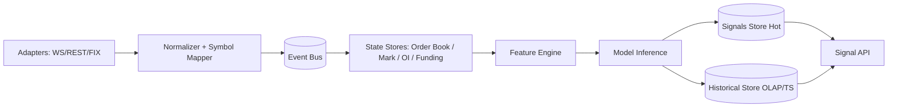
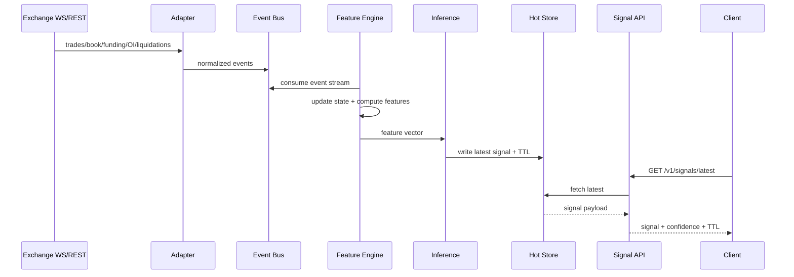
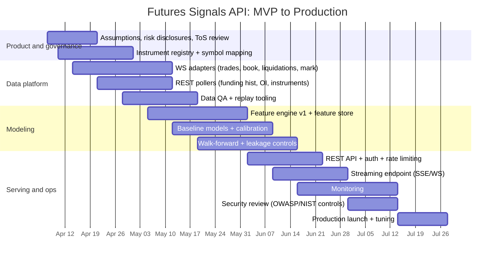

# Designing and Building a Crypto Futures Trading Signal API

## Executive summary

A “crypto futures trading signals API” is best treated as a **real-time decision-support system** built on three hard problems: (1) **reliable multi-venue data ingestion** (order books, trades, mark/index prices, funding, open interest, liquidations, options-implied volatility, and optionally on-chain flows), (2) **labeling and evaluation that match executable reality** (transaction costs, slippage, latency, and survivorship), and (3) **a stable serving contract** (REST + streaming, explicit signal TTL, confidence calibration, versioning, and monitoring/model drift controls).

Primary exchange docs show that the data sources you need are heterogeneous in cadence and semantics:

- **Order book deltas** can arrive as fast as **10–200ms** on Bybit depending on depth level, requiring local state and strict snapshot/delta handling. citeturn10search3  
- Binance USDⓈ-M futures provides diff book depth streams with update speeds down to **100ms**. citeturn0search0  
- Funding and mark price are available both via REST and WebSocket; for example Binance mark price streams can update every **1s** (or 3s), and the mark price REST endpoint is a key reference dataset for perps. citeturn0search12turn0search4  
- Open interest is queryable via REST (e.g., Binance `GET /fapi/v1/openInterest`) and also streamable on some venues (OKX has an `open-interest` channel with `oi`, `oiUsd`, timestamps). citeturn6search0turn4view2  
- Liquidations are venue-specific and sometimes incomplete: OKX’s `liquidation-orders` channel explicitly states the feed is **not the total number of liquidations** and may be **out of chronological order**. citeturn5view0turn5view3  

From an empirical modeling perspective, the academic literature reinforces that **microstructure and order flow signals** can be predictive (e.g., order flow predictability for crypto returns; order imbalance linked to crash risk; LOB deep learning for short-horizon prediction). citeturn11search1turn11search13turn11search11  
Separately, derivatives-specific variables (funding, basis/carry, open interest structure) are economically meaningful features tied to positioning and leverage dynamics—captured in both practitioner explanations (funding as periodic payment between longs/shorts) and academic work on perpetual futures. citeturn0search8turn11search8turn11search22  

A production-grade API must also assume **regulatory and contractual constraints**: exchange API use is governed by terms (e.g., OKX API Agreement permitted use; Bybit API terms; Binance API key terms), and distributing “signals” can cross into “investment advice” or “CTA-like” activity depending on jurisdiction, personalization, compensation, and marketing. citeturn18search1turn18search0turn18search2turn17search12turn17search17turn17search3  

---

## Scope and assumptions

Because you did not specify budget, latency, asset universe, jurisdiction, or whether signals are personalized, this report makes explicit baseline assumptions (you should adjust them as needed):

1. **Product scope**: You provide *non-custodial* signals (recommendations/forecasts) via API; you **do not place orders** on behalf of users. (Execution integration is discussed as optional.)  
2. **Universe**: Primarily perpetual futures (linear and inverse) on major CEXs; optionally futures expiries and options-derived features. Instruments are continuously changing; therefore you must maintain an instrument registry and treat delistings as first-class events (survivorship control).  
3. **Data “truth”**: Your ground truth is defined by **public market data** (trades/order book/mark/index/funding/OI/liquidations where available). You do **not** have access to private account positioning for the market as a whole, so “positioning” features are inferred (OI, funding, basis, liquidations).  
4. **Latency target**: Not specified. We assume an MVP target of **sub-second** signal refresh for short horizons (seconds to minutes), and **seconds-level** freshness for longer horizons (15m–4h). This is aligned with exchange feed cadences (e.g., 100ms–1s updates for key streams). citeturn0search0turn10search3turn0search12  
5. **Compliance posture**: Your service is designed to remain “impersonal” (non-personalized) unless you explicitly choose a regulated path; you avoid prohibited data redistribution and honor exchange terms and data licensing.

---

## Data sources and data acquisition

### Market and derivatives data sources

A robust futures signals system typically ingests the following categories. The “why” is tied directly to futures/perps mechanics:

- **Trades (prints)**: Used for realized volatility, volume imbalance, trade intensity, and event labels. Bybit pushes recent trades in real time, and a single message can contain up to **1024 trades** (important for batching/processing design). citeturn10search7  
- **Order books (L2/L3 depending on venue/product)**: Used for microstructure features (order book imbalance, depth slope, liquidity gaps, queue dynamics). Bybit’s public order book supports multiple depths with push frequencies down to **10ms** and provides explicit local book snapshot/delta processing rules. citeturn10search3turn0search1  
- **Mark price / index price / premium**: Perpetual contracts settle funding and liquidations with **mark price** conventions; Binance provides a mark price REST endpoint and a mark price stream (1s/3s). citeturn0search4turn0search12  
- **Funding rates**: A core perp signal: funding is a periodic transfer between longs and shorts designed to keep perp price close to spot/index; Binance explains the intuition and sign behavior (bullish markets often positive funding). citeturn0search8  
  - Binance offers funding rate history via `GET /fapi/v1/fundingRate`. citeturn6search1  
  - Bybit provides `Get Funding Rate History`, and notes funding intervals vary by symbol. citeturn1search1  
  - OKX provides a `funding-rate` WebSocket channel, with data pushed in **30–90s**, and includes `fundingRate`, `fundingTime`, bounds, and premium-formula fields. citeturn4view1  
- **Open interest (OI)**: A proxy for total outstanding leverage/positioning.  
  - Binance has `GET /fapi/v1/openInterest` for present OI. citeturn6search0  
  - Bybit’s OI endpoint warns that during extreme volatility it may have increased latency/delays. citeturn10search0  
  - OKX provides streaming `open-interest` with multiple units (`oi`, `oiCcy`, `oiUsd`). citeturn4view2  
- **Historical liquidations**: Useful as (a) features (“liquidation pressure” regimes) and (b) event labels (“cascade windows”). Availability varies:  
  - Bybit provides an `allLiquidation.{symbol}` topic, push frequency **500ms**. citeturn10search2  
  - OKX provides `liquidation-orders` but states each contract shows at most one order per second and the data **doesn’t represent total liquidations**; it may also be **not chronological**. citeturn5view0turn5view3  
- **Implied volatility and options-derived signals**: While your target is futures signals, options IV is often a leading risk signal (risk premium, skew regimes).  
  - Binance describes **BVOL** as an implied volatility index derived from Binance options and calculated using weighted IV of selected options contracts. citeturn12search5  
  - Bybit offers option “historical volatility” data via `GET /v5/market/historical-volatility`. citeturn12search3  
  - entity["company","Deribit","crypto derivatives exchange"] publishes DVOL as a 30-day annualized implied volatility gauge using implied volatility smiles of relevant expiries. citeturn12search0turn12search4  

### On-chain and related alternative data

On-chain can improve medium-horizon signals and risk regimes, but it adds cost and engineering complexity.

- **Direct node RPCs**:  
  - Ethereum execution clients expose a standardized JSON-RPC API (canonical interface across clients). citeturn13search0turn13search4  
  - Bitcoin Core exposes RPC endpoints such as `getrawmempool`, which returns transaction IDs in the mempool (or verbose detail), enabling mempool congestion features. citeturn13search1turn13search5  
- **Indexing layers**: entity["organization","The Graph","blockchain indexing protocol"] provides a GraphQL query API for querying indexed on-chain data (subgraphs), which can reduce the need to run your own indexing infrastructure. citeturn13search2turn13search6  
- **Analytics query platforms**: entity["company","Dune","blockchain analytics platform"] supports executing saved queries via API—useful for prototypes and some production workflows, but you must manage query latency and dependency risk. citeturn13search3turn13search7  

### Data collection methods and legal/operational trade-offs

A typical ingestion strategy is intentionally hybrid:

- **WebSocket** for high-frequency streams (order book, trades, liquidations, some mark/funding channels). Exchanges recommend it for market data and depth (OKX explicitly recommends WebSocket for market data and order book depth and sets connection/request limits). citeturn3view0  
- **REST** for “pull” facts: instruments metadata, historical bars, funding history, OI snapshots, and backfills. Binance’s general info emphasizes that timestamps are in milliseconds and the base endpoint is `https://fapi.binance.com`, which guides schema normalization. citeturn6search11  
- **FIX** if you later add execution-grade integration or institutional feed quality. The archived FTX US docs show REST + WebSocket + FIX as a cohesive set intended for algorithmic trading. citeturn9view0  
- **Scraping**: treat as last resort. It is brittle (HTML changes), high-maintenance, and can violate exchange/platform terms. Exchange API agreements and product terms typically govern permitted uses and may restrict redistribution/resale in some contexts (e.g., OKX agreements and Bybit API terms; Binance API key terms). citeturn18search1turn18search0turn18search2turn18search8turn18search21  

A practical rule: **if a datum affects P&L at high frequency, do not scrape it**; prefer official API channels and design for reconnections, gaps, and versioned schemas.

---

## Feature engineering and labeling

### Feature families for crypto futures signals

Signal quality is usually not about a single indicator, but about **coherent feature families** tied to hypotheses. The table below lists common families, examples, and typical cadence.

| Feature family | Examples (not exhaustive) | Typical data needs | Typical horizon where it helps | Notes / evidence |
|---|---|---|---|---|
| Price/return technicals | returns, SMA/EMA, RSI, MACD, Bollinger Bands, ATR, Donchian, VWAP deviations | bars/trades | minutes–days | Baseline features; easy and fast |
| Volatility features | realized vol, realized range, GARCH-type proxies, vol-of-vol | trades/bars | minutes–days | For sizing and regime filters; order flow can help predict short-term realized vol. citeturn11search9 |
| Order book shape | book imbalance, depth slope, spread, top-of-book resilience, liquidity gaps | L2 book snapshots + deltas | seconds–minutes | Deep learning and engineered LOB features can predict very short-horizon moves in some settings. citeturn11search11turn10search3 |
| Trade microstructure | signed volume, trade imbalance, VPIN-like metrics, burstiness, inter-trade times | trades | seconds–minutes | Order flow has documented predictive content for crypto returns. citeturn11search1turn11search13 |
| Funding & basis | funding rate level/changes, funding “shock”, perp-spot premium, funding interval effects | mark/index + funding | hours–days | Funding is central in perps mechanics; models and papers treat funding as a feedback rule. citeturn0search8turn11search8 |
| Open interest dynamics | OI level, ΔOI, OI×vol, OI acceleration, OI vs price divergence | OI time series | minutes–days | OI is a positioning proxy; streamable on OKX and queryable elsewhere. citeturn4view2turn6search0 |
| Liquidation pressure | liquidation notional rate, liquidation clustering, “cascade score” | liquidation streams | minutes–hours | Feeds can be incomplete/noisy on some venues; use as regime feature not absolute truth. citeturn5view0turn10search2 |
| Options/IV regime | IV level, IV change, skew, IV vs realized vol, BVOL/DVOL-type indices | options market or IV index | hours–days | Options IV is forward-looking risk; Binance BVOL and Deribit DVOL are examples. citeturn12search5turn12search0 |
| On-chain flows | exchange inflows/outflows, stablecoin issuance/redemptions, fee pressure, mempool congestion | node RPC / indexers | hours–weeks | Higher latency but can signal risk-on/off; uses standard RPCs for raw data. citeturn13search0turn13search1 |
| Sentiment / news | social sentiment score, funding narratives, event calendars | external feeds | minutes–days | Often noisy; use as weak prior; deep learning surveys note sentiment as a predictor class. citeturn11search23 |

### Indicator comparison table requested: precision vs latency vs cost

Because “precision” depends on your label definition and horizon, the table below uses **expected predictive usefulness** (Low/Med/High) under typical assumptions and highlights compute + data-cost impact.

| Indicator/feature set | Expected predictive usefulness | Latency sensitivity | Compute cost | Data cost / complexity | When it usually fails |
|---|---|---|---|---|---|
| Simple momentum (returns, EMA cross) | Low–Med | Low | Low | Low | Choppy regimes, fee drag dominates |
| Volatility targeting (ATR/realized vol) | Med (for risk-adjusted outcomes) | Low–Med | Low | Low | When volatility shifts faster than your estimator |
| Funding shocks (Δfunding, premium index) | Med | Med | Low | Med | When funding is capped/structured or regime changes (funding rules vary) citeturn4view1turn6search1 |
| OI-price divergence | Med | Med | Low | Med | If OI is stale/delayed during volatility spikes citeturn10search0 |
| Order book imbalance + depth slope | Med–High (seconds–minutes) | High | Med | High (book streams) | If you cannot maintain correct local books or you downsample too aggressively citeturn10search3turn0search0 |
| Learned LOB embeddings (CNN/Transformer on LOB) | Potentially High (very short horizon) | Very High | High | Very High | Overfitting, exchange microstructure drift, latency makes it untradeable citeturn11search11 |
| Liquidation clustering | Med (risk regime) | Med | Med | Med | If venue data is incomplete or throttled; cross-venue normalization is hard citeturn5view0turn10search2 |
| Options IV regime (BVOL/DVOL) | Med | Low–Med | Low–Med | Med | If IV feed is sparse or dominated by market maker quoting conventions citeturn12search5turn12search0 |
| On-chain flows | Low–Med (short) / Med (medium) | Low | Med | High (indexing) | “False signals” during internal exchange movements; attribution errors citeturn13search2 |

### Feature schema example

A common production pattern is to compute **feature vectors keyed by (instrument, timestamp, horizon)** and store both raw + derived values with lineage.

```json
{
  "ts_ms": 1764864000123,
  "exchange": "binance",
  "instrument_id": "perp:BTCUSDT",
  "bar_interval": "1m",
  "features": {
    "ret_1m": -0.0008,
    "ret_5m": 0.0021,
    "rsi_14": 47.3,
    "atr_14": 112.5,
    "realized_vol_30m": 0.0142,

    "spread_bps": 0.35,
    "book_imbalance_l1": -0.18,
    "depth_1pct_usd": 12500000,
    "ofi_10s": 0.62,
    "trade_imbalance_30s": -0.11,

    "funding_rate": 0.0001,
    "funding_rate_chg": 0.00005,
    "oi_usd": 1939251795.55,
    "oi_chg_5m": 12000000,

    "liq_notional_5m": 4500000,
    "liq_cluster_score_30m": 0.73,

    "iv_index_30d": 0.62,
    "onchain_exchange_inflow_usd_1h": 18000000
  },
  "lineage": {
    "mark_price_source": "ws",
    "orderbook_source": "ws",
    "funding_source": "rest",
    "oi_source": "rest",
    "liquidation_source": "ws",
    "iv_source": "index",
    "onchain_source": "subgraph"
  },
  "feature_version": "v1.3.0"
}
```

### Labeling and “ground truth” design

A rigorous signals product starts with labels that reflect how a user could trade:

1. **Return-based labels** (simple, common):  
   - Label = sign(log return over horizon H) with a “dead zone” threshold to avoid noise/fees.  
   - Pros: easy; Cons: sensitive to fee/slippage assumptions.

2. **Event-based labels (triple barrier)**:  
   - Set profit-take, stop-loss, and time limit; label depends on which barrier is hit first.  
   - This is widely used in financial ML because it ties labels to risk-reward and avoids arbitrary horizons; recent crypto-focused research explicitly uses Triple Barrier as a key innovation for label generation. citeturn16search7  

3. **Execution-aware labels**:  
   - Use an execution model: entry at mid/mark or simulated market order with order book slippage; include fees; include latency (decision time vs execution time).  
   - This matters because high-frequency order book features are latency-sensitive; Bybit and Binance support very fast book updates, but your inference+network must keep up. citeturn10search3turn0search0  

4. **Liquidation/cascade event labels** (if your signals are “risk alerts”):  
   - Label could be “probability of liquidation cluster in next 5–15m” using liquidation stream intensity; but note OKX’s liquidation feed is explicitly incomplete. citeturn5view0  

---

## Modeling, backtesting, and evaluation

### Modeling approaches and trade-offs

A mature system usually progresses through these stages:

**Statistical baselines (fast, interpretable)**  
- Logistic/linear regression with regularization; regime filters; volatility scaling.  
- The Bitcoin futures forecasting literature includes approaches using variable selection and model averaging (e.g., LASSO + Bayesian model averaging) over spot and futures predictors. citeturn11search6  

**Tree-based ML (strong tabular performance)**  
- Gradient boosted trees (e.g., XGBoost/LightGBM) on engineered features: tends to be strong with heterogeneous signals (OI, funding, vol, book imbalance).  
- Pros: strong baseline, explainability via SHAP; Cons: can overfit if you leak future data.

**Deep learning (sequence + microstructure)**  
- CNN/TCN/LSTM/Transformers for multi-scale temporal features; learned embeddings for LOB.  
- Evidence exists that temporal CNNs can predict short-horizon moves from LOB data in digital assets (example: 2-second horizon results reported in a LOB deep learning paper). citeturn11search11  
- Risks: nonstationarity, microstructure changes by exchange, latency constraints can nullify paper gains.

**Ensembles**  
- Often best operationally: combine a low-latency microstructure model (seconds horizon) with a slower regime model (hours horizon) and a risk overlay.

**Reinforcement learning (RL)**  
- Useful mainly when you control execution (position sizing, market making) and can simulate environment accurately. As a signals API, RL is usually used as an internal policy layer rather than a directly exposed model.

### Backtesting and evaluation methodology

Key pitfalls in futures signals evaluation are typically **more dangerous than model choice**:

- **Walk-forward evaluation**: Evaluate the system in rolling windows with periodic retraining to mimic production deployment; described as a more realistic approach than static backtests. citeturn16search0  
- **Leakage control (purging/embargo)**: When labels depend on future events, standard CV leaks information; financial ML guidance emphasizes purging and embargoing to reduce leakage and avoid backtest overfitting. citeturn20search12turn20search18  
- **Transaction costs and slippage**: Must include maker/taker fees, funding payments (for holding), and slippage derived from book depth. Funding is a real cashflow between longs and shorts. citeturn0search8  
- **Latency modeling**: If your prediction horizon is seconds, a 200–500ms delay can invert results. This is critical where order book updates arrive at 10–200ms speed. citeturn10search3turn0search0  
- **Survivorship and instrument churn**: Perps/futures listings change; you must backtest on the *historical universe* and include delistings, symbol changes, and exchange outages. Bybit’s changelog cadence illustrates that APIs and fields change; build versioned adapters and schema evolution as a feature. citeturn0search9  
- **Data integrity for liquidation feeds**: OKX explicitly warns liquidation updates may not be chronological and are not total liquidations; treat as noisy observations, not ground truth. citeturn5view0turn5view3  

Suggested evaluation metrics (pair both statistical and trading metrics):

- Statistical: AUC, precision/recall (for rare event signals), calibration error (ECE), information coefficient (IC).  
- Trading: net Sharpe/Sortino, drawdown, hit rate by regime, turnover, and capacity (impact vs depth).

---

## Real-time architecture, storage, and observability

### Streaming architecture pattern

A production signals API is typically built as a streaming pipeline:

- Exchange adapters (WS + REST) normalize into a canonical schema.
- A message bus distributes events to stateful processors (order book builder, feature calculators, labelers in offline training).
- An inference service emits signals into a “signals topic” and a low-latency store.
- A serving API reads latest signals + history from hot cache/OLAP.



This architecture is driven by observed upstream behavior:
- Fast WS feed rates (e.g., Bybit order book levels down to 10ms; Binance depth to 100ms). citeturn10search3turn0search0  
- Incomplete/nuanced liquidation feeds (OKX limitations), encouraging cross-venue aggregation and conservative use. citeturn5view0  
- Rate limit and connection limit constraints: OKX documents connection limiting (e.g., subscribe request limits per hour and connection stability rules). citeturn3view0  
- Archived FTX US docs highlight HTTP 429 for rate limits and time-range pagination patterns (`start_time`, `end_time`). citeturn9view0  

### Storage and indexing

A practical tiering strategy:

- **Hot store** (seconds–hours): Redis-like cache for latest signals, per-instrument state, and user rate limiting.  
- **Warm analytics store** (days–months): columnar OLAP for feature/signal history queries (fast range scans, grouping by time, symbol).  
- **Cold store** (months–years): object storage partitioned by date/exchange/instrument for low-cost retention and reproducible training datasets.

Retention policies should be explicit:
- Raw L2 deltas: shortest retention (volume heavy)  
- Aggregated snapshots (e.g., 1s, 1m) + features: longer  
- Signals + metadata: longest (auditing + customer reproducibility)

### Monitoring and observability

A signals API should monitor *three* truth layers:

1. **Data quality**: missing ticks, sequence gaps, stale books, time skew, out-of-order events (OKX liquidation-order warning is a concrete example of out-of-order risk). citeturn5view3  
2. **Model behavior**: drift in feature distributions, drift in calibration, performance decay by regime.  
3. **Trading reality proxies**: ex-post P&L from a standardized paper portfolio; funding-adjusted returns; slippage estimates using book depth.

---

## Signal API design, security, compliance, and delivery plan

### Signal types and outputs

A useful contract makes signal semantics machine-checkable:

- **Direction**: `LONG | SHORT | FLAT`  
- **Timeframe / horizon**: e.g., `5m`, `15m`, `1h`  
- **Confidence**: probability of success (calibrated) or distribution quantiles  
- **Entry assumption**: mark/mid/last; include `decision_ts` and `expected_execution_delay_ms`  
- **Risk envelope**: suggested stop/target (optional) + rationale (vol-based, structure-based)  
- **TTL**: explicit signal expiration timestamp  
- **Model version** and **feature version** (for audit and reproducibility)

### Example OpenAPI-style endpoint definitions

```yaml
openapi: 3.0.3
info:
  title: Crypto Futures Signals API
  version: 1.0.0
servers:
  - url: https://api.example.com
security:
  - ApiKeyAuth: []
components:
  securitySchemes:
    ApiKeyAuth:
      type: apiKey
      in: header
      name: X-API-KEY
paths:
  /v1/instruments:
    get:
      summary: List supported instruments
      parameters:
        - in: query
          name: exchange
          schema: { type: string }
        - in: query
          name: type
          schema: { type: string, enum: [perp, futures] }
      responses:
        "200":
          description: Instrument list
  /v1/signals/latest:
    get:
      summary: Get latest signal for an instrument and horizon
      parameters:
        - in: query
          name: instrument_id
          required: true
          schema: { type: string }
        - in: query
          name: horizon
          required: true
          schema: { type: string, example: "15m" }
      responses:
        "200":
          description: Latest signal payload
  /v1/signals/history:
    get:
      summary: Get signal history (cursor paginated)
      parameters:
        - in: query
          name: instrument_id
          required: true
          schema: { type: string }
        - in: query
          name: horizon
          required: true
          schema: { type: string }
        - in: query
          name: start_ms
          schema: { type: integer }
        - in: query
          name: end_ms
          schema: { type: integer }
        - in: query
          name: cursor
          schema: { type: string }
        - in: query
          name: limit
          schema: { type: integer, default: 500, maximum: 5000 }
      responses:
        "200":
          description: Page of signals
  /v1/stream/signals:
    get:
      summary: Server-sent events stream for signals
      description: Streams new or updated signals. Client supplies filters in query.
```

Design notes anchored in primary sources:
- Cursor/time-window pagination is common in exchange APIs; archived FTX US docs show time-bound pagination via `start_time` and `end_time`. citeturn9view0  
- Rate limiting is a reality: FTX US docs note HTTP 429 on rate limit hits; OKX documents per-connection subscribe/unsubscribe limits and keepalive patterns. citeturn9view0turn3view0  

### Dataflow sequence diagram



### Technology options and trade-offs table

| Layer | “Fast path” option | “Research-friendly” option | Trade-off summary |
|---|---|---|---|
| Adapters/ingestion | Go/Rust for WS fan-in; strict memory control | Python for speed of development | Low-level languages reduce latency and GC spikes; Python accelerates iteration |
| Streaming/broker | Kafka-compatible managed service (via entity["company","Confluent","managed kafka provider"]) | Redis Streams for MVP | Kafka family excels at replay and fanout; Redis is simpler but less suited for large durable event logs citeturn19search1 |
| Feature compute | Stateful stream processors (Flink/Spark Streaming) or custom workers | Batch compute notebooks | Stream processors support low-latency features; batch is cheaper but not “live” |
| Hot store | entity["company","Redis","in-memory datastore vendor"] | Postgres + cache | Redis reduces p99 read latency for “latest signal” endpoints |
| Historical analytics | entity["company","ClickHouse","columnar analytics database vendor"] | TimescaleDB/Tiger Cloud | Columnar OLAP is great for wide feature tables; time-series DBs are great for metrics citeturn19search4turn19search2 |
| Search/metadata | entity["company","Elastic","search and analytics vendor"] | Postgres | Useful for instrument discovery, audit logs, and full-text “explanations” |
| Backtesting engine | entity["organization","QuantConnect","algorithmic trading platform"] LEAN or entity["organization","NautilusTrader","open-source trading engine"] | Backtrader / vectorbt | LEAN/NautilusTrader focus on event-driven parity; vectorbt is fast for parameter sweeps citeturn14search2turn14search3turn14search0turn14search1 |

### Security requirements

A paid signals API is an API-security product as much as a quant product:

- Align controls with entity["organization","OWASP","api security project"] API Security Top 10 (e.g., Broken Object Level Authorization is listed as API1:2023). citeturn21search1turn21search0  
- Use modern authorization standards: OAuth 2.0 for user-facing apps and short-lived tokens for streaming clients (OAuth 2.0 framework per RFC 6749). citeturn21search3  
- Follow API protection guidance such as entity["organization","NIST","us standards institute"] SP 800-228 for API lifecycle risk/control thinking, and key management guidance (SP 800-57 family). citeturn21search2turn21search9  
- Secrets management: centralize storage/rotation and minimize blast radius (OWASP secrets management guidance). citeturn21search13  

### Legal and compliance considerations

Two separate constraint sets apply:

**Exchange and data licensing / terms**  
- Your access to exchange APIs is governed by their published agreements/terms; ensure your use and any redistribution/derivation is permitted. Examples: OKX API Agreement “permitted use,” Bybit API Terms, Binance API key terms. citeturn18search1turn18search0turn18search2  
- Some agreements explicitly restrict redistribution/resale in certain API contexts (e.g., OKX Web3 Build user agreement language restricting redistribution; OKX P2P API agreement language on no dissemination/resale). citeturn18search21turn18search8  

**Financial regulation / “signals as advice” risk**  
- In the U.S., providing advice for compensation can implicate the Investment Advisers Act definition and related SEC interpretations; “commodity trading advisor” concepts apply to futures/derivatives advice under U.S. commodities regulation. citeturn17search12turn17search17turn17search5  
- In the EU, ESMA guidance explains “investment advice” as personal recommendations under MiFID II. citeturn17search3turn17search7  
- In the UK, the FCA regulates financial promotions and requires promotions to be clear, fair, and not misleading. citeturn17search2turn17search6  

Practical mitigations (product/legal design choices):
- Keep signals **impersonal** (not tailored to a client’s circumstances), provide **methodology disclosure**, and avoid “guaranteed returns” claims.
- Provide “model limitations” and “risk disclosures” in the API terms and documentation.
- If you move into personalization, portfolio sizing recommendations, or execution, assume you may need jurisdiction-specific licensing and compliance programs.

### Cost estimates and latency/cost trade-offs

Order-of-magnitude monthly cost bands (highly sensitive to: number of symbols, book depth, storage retention, and whether you keep raw L2 deltas):

| Scale | Coverage and features | Typical infra shape | Approx cost band (USD/month) | Key cost drivers |
|---|---|---|---|---|
| Small | 10–30 perps; 1m–5m signals; limited book depth; basic ML | 2–4 VMs + managed DB + cache | ~$1k–$5k | compute + managed storage; modest egress |
| Medium | 50–200 perps; multi-horizon signals; WS streaming; OLAP history | broker + OLAP + cache + model serving | ~$10k–$60k | broker throughput + OLAP storage + egress |
| Large | 500+ perps; deep books; near-real-time microstructure ML; long retention | multi-region + durable log + OLAP + object storage | ~$80k–$300k+ | network + storage + ingestion + SRE |

Useful anchor points from public pricing:
- AWS EC2 t3.large is listed starting around **$0.0832/hour** (baseline compute mental model). citeturn19search3  
- ClickHouse Cloud ClickPipes lists ingestion at **$0.04/GB** and compute unit pricing (one relevant cost axis if you use managed ingestion). citeturn19search0turn19search4  
- Confluent Cloud billing is consumption-based and typically depends on throughput, storage, and connector usage (see Confluent billing overview). citeturn19search1turn19search13  

Latency vs cost levers:
- Storing raw L2 deltas enables the best microstructure signals and replays, but increases storage and compute.
- Downsampling to 1s/1m snapshots reduces cost but weakens short-horizon edge and makes slippage modeling less realistic.
- Streaming (WS) reduces REST rate-limit pressure but increases stateful system complexity (local books, reconnect logic). citeturn10search3turn3view0  

### MVP to production timeline (Gantt-style)



This timeline reflects real exchange integration work: handling high-frequency books (snapshot/delta semantics), varying cadences (e.g., OKX funding pushed 30–90s; Bybit books as fast as 10ms), and rate-limited REST backfills. citeturn10search3turn4view1turn9view0